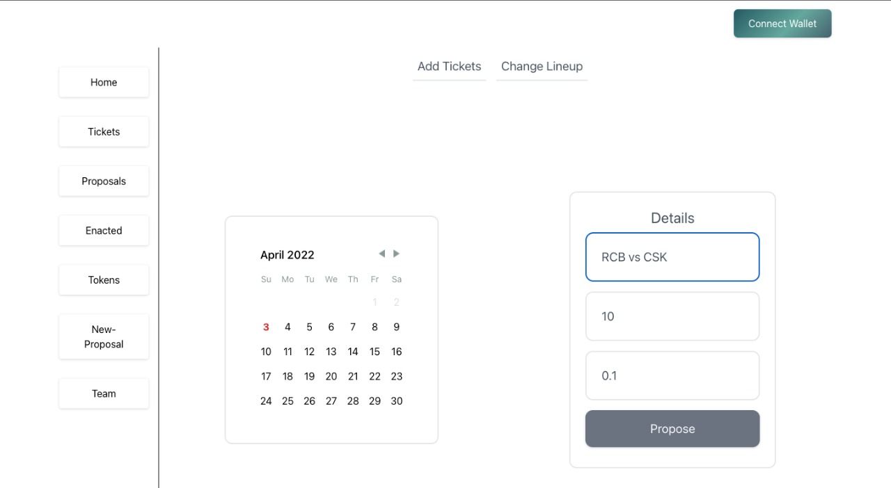
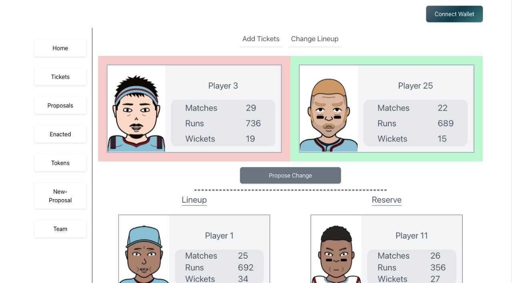
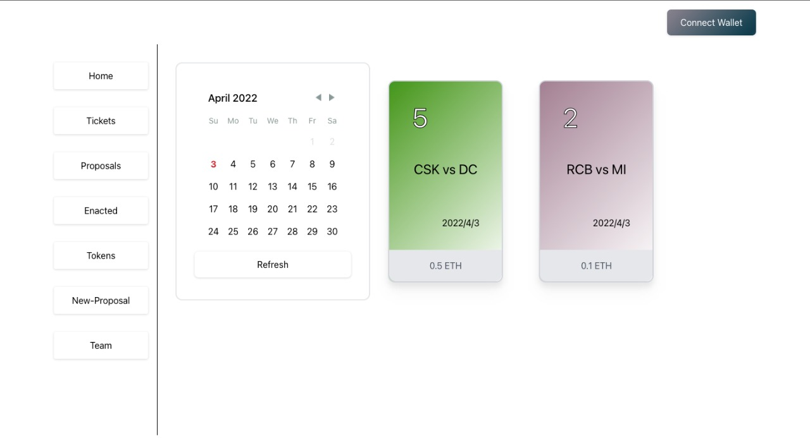
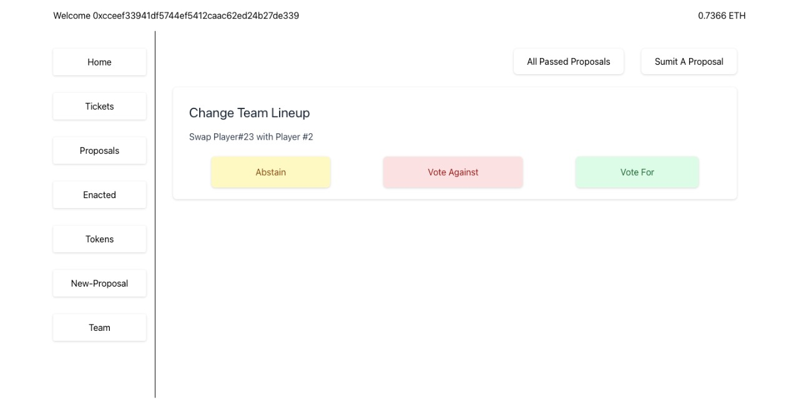
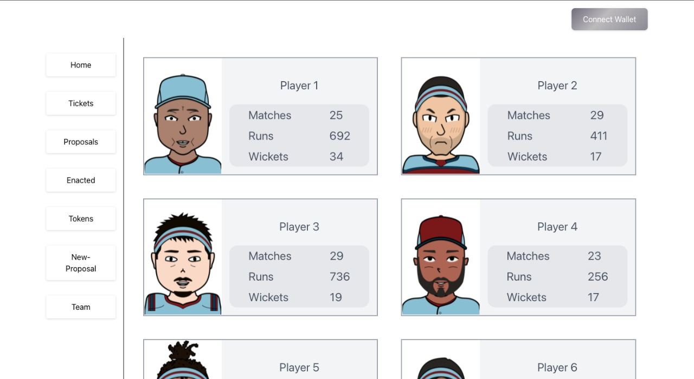

# Cricket-DAO

This cricket DAO is for the cricket fans who can know not only enjoy the cricket matches but can also have thier say in ticket prices, ticket amounts and as well as the team lineup. The DAO currently has 25 players. 

Any user who wishes to make changes in the existing system can put out a proposal.
The proposal is then voted by the members of the DAO. Each proposal is open for a certain duration and based on the votes if the proposal gets accepted it is added to the enacted page where the governor or the DAO members can execute the proposal and the changes mentioned in the proposal take place.

Below are the few screenshots of our website.

## **⚡️** Screenshots

